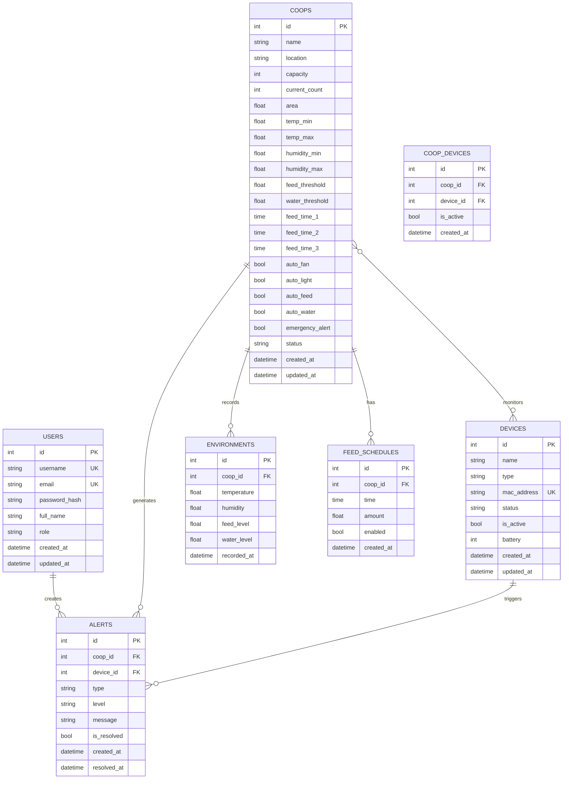

# AutomatedChickenFarmManagement

## 1. Tổng quan Dự án

**Mục tiêu:** Hệ thống quản lý trang trại gà thông minh sử dụng tự động hóa và giám sát dựa trên dữ liệu để tối ưu hóa hiệu quả chăn nuôi và sức khỏe gà.

**Trạng thái phát triển:**
- Frontend: ✓ Hoàn tất đầy đủ chức năng quản lý
- Backend: Đang phát triển - Database Models đã hoàn tất

---

## 2. Cấu trúc Dự án

```
AutomatedChickenFarmManagement/
├── static/                      # Frontend (SB Admin 2 theme)
│   ├── index.html               # Dashboard chính
│   ├── coop-list.html           # Danh sách chuồng
│   ├── coop-detail.html         # Chi tiết chuồng
│   ├── device-list.html          # Danh sách thiết bị
│   ├── device-detail.html        # Chi tiết thiết bị
│   ├── camera.html              # Danh sách camera
│   ├── camera-detail.html       # Chi tiết camera
│   ├── other.html               # Chức năng khác
│   └── css/js/vendor/img/       # Tài nguyên frontend
├── backend/                     # Flask Backend API
│   ├── app.py                   # Entry point
│   ├── models.py                # Database models (7 tables)
│   ├── config.py                # Cấu hình hệ thống
│   ├── requirements.txt         # Python dependencies
│   └── api/routes/              # API Endpoints
│       ├── auth.py              # Authentication
│       ├── coops.py              # Coop CRUD
│       ├── devices.py           # Device management
│       ├── dashboard.py         # Dashboard & stats
│       ├── camera.py            # Camera control
│       ├── feed_schedule.py     # Lịch cho ăn
│       ├── environment.py       # Dữ liệu môi trường
│       └── alerts.py            # Quản lý cảnh báo
├── README.md                    # Tài liệu chính
└── .gitignore
```

---

## 3. Cấu trúc Backend & Database

### Thư mục Backend
```
backend/
├── config.py              # Cấu hình (Development/Production/Testing)
├── models.py              # Database Models (Flask-SQLAlchemy)
├── requirements.txt       # Python dependencies
├── app.py                 # Flask entry point
└── api/
    ├── __init__.py       # API Blueprint Factory
    └── routes/           # API endpoints
```

### Database Schema

| Table | Mô tả | Relationships |
|-------|-------|---------------|
| `users` | Người dùng hệ thống | 1-N → alerts |
| `coops` | Chuồng gà | 1-N → environments, feed_schedules, alerts; N-N ← devices |
| `devices` | Thiết bị IoT | 1-N → alerts; N-N ← coops |
| `coop_devices` | Bảng trung gian N-N | - |
| `environments` | Dữ liệu môi trường | N-1 → coops |
| `feed_schedules` | Lịch cho ăn | N-1 → coops |
| `alerts` | Cảnh báo | N-1 → coops, devices |

### ERD Sơ Đồ

       +-------------------+             +-----------------------+
       |       USER        |             |         ALERT         |
       +-------------------+             +-----------------------+
       | id (PK)           |             | id (PK)               |
       | username          |             | level (info/warn/crit)|
       | email             |             | message               |
       | password_hash     |             | is_resolved (bool)    |
       | role (admin/worker)             | resolved_at           |
       | full_name         |       +---->| coop_id (FK)          |
       | created_at        |       |     | device_id (FK)        |
       +-------------------+       |     +-----------------------+
                                   |
                                   |             
       +-------------------+       |     +-----------------------+
       |       COOP        |-------+     |      ENVIRONMENT      |
       +-------------------+             +-----------------------+
       | id (PK)           |             | id (PK)               |
       | name              |             | temperature           |
       | location          |             | humidity              |
       | capacity          |       +---->| feed_level            |
       | current_count     |       |     | water_level           |
       | status            |       |     | recorded_at           |
       | [Thresholds...]   |       |     | coop_id (FK)          |
       +---------+---------+       |     +-----------------------+
                 |                 |
                 | (1)             | (1)
                 |                 |
                 | (n)             | (n)
       +---------+---------+       |     +-----------------------+
       |    COOP_DEVICE    |-------+     |        DEVICE         |
       +-------------------+             +-----------------------+
       | id (PK)           |             | id (PK)               |
       | coop_id (FK)      |------------>| name                  |
       | device_id (FK)    |        (1)  | type (camera/sensor..)|
       +-------------------+             | status                |
                                         | mac_address           |
                                         | is_active (bool)      |
                                         +-----------------------+

### Relationships Summary

```
USERS ──────────────► ALERTS
   │                    ▲
   │                    │
   ▼                    │
COOPS ◄───────────────► DEVICES
   │                    │
   ├──► ENVIRONMENTS
   │
   ├──► FEED_SCHEDULES
   │
   └─► COOP_DEVICES ◄─┘
```

### Mermaid ERD Diagram



### Chi tiết Tables

```
users:          id, username, email, password_hash, full_name, role, created_at, updated_at
coops:          id, name, location, capacity, current_count, area,
                temp_min, temp_max, humidity_min, humidity_max,
                feed_threshold, water_threshold,
                feed_time_1, feed_time_2, feed_time_3,
                auto_fan, auto_light, auto_feed, auto_water,
                emergency_alert, status, created_at, updated_at
devices:        id, name, type, mac_address, status, is_active, battery, created_at, updated_at
coop_devices:   id, coop_id, device_id, is_active, created_at
environments:   id, coop_id, temperature, humidity, feed_level, water_level, recorded_at
feed_schedules: id, coop_id, time, amount, enabled, created_at
alerts:         id, coop_id, device_id, type, level, message, is_resolved, created_at, resolved_at
```

---

## 4. API Endpoints

| Nhóm | Method | Endpoint | Mô tả |
|------|--------|----------|-------|
| **Auth** | POST | `/api/auth/login` | Đăng nhập, nhận JWT token |
| | POST | `/api/auth/register` | Đăng ký user mới |
| | GET | `/api/auth/me` | Lấy thông tin user hiện tại |
| | POST | `/api/auth/logout` | Đăng xuất |
| **Coops** | GET | `/api/coops` | Danh sách chuồng |
| | POST | `/api/coops` | Tạo chuồng mới |
| | GET | `/api/coops/<id>` | Chi tiết chuồng |
| | PUT | `/api/coops/<id>` | Cập nhật chuồng |
| | DELETE | `/api/coops/<id>` | Xóa chuồng |
| | GET | `/api/coops/<id>/devices` | Thiết bị trong chuồng |
| | GET | `/api/coops/<id>/environment` | Dữ liệu môi trường hiện tại |
| | GET | `/api/coops/<id>/history` | Lịch sử dữ liệu |
| **Devices** | GET | `/api/devices` | Danh sách thiết bị |
| | POST | `/api/devices` | Tạo thiết bị mới |
| | POST | `/api/devices/connect` | Kết nối thiết bị (QR/mã) |
| | GET | `/api/devices/<id>` | Chi tiết thiết bị |
| | PUT | `/api/devices/<id>` | Cập nhật thiết bị |
| | DELETE | `/api/devices/<id>` | Xóa thiết bị |
| | POST | `/api/devices/<id>/toggle` | Bật/tắt thiết bị |
| | POST | `/api/devices/<id>/assign` | Gán thiết bị vào chuồng |
| | PATCH | `/api/devices/<id>/name` | Đặt tên thiết bị |
| **Dashboard** | GET | `/api/dashboard` | Tổng quan dashboard |
| | GET | `/api/dashboard/stats` | Thống kê chi tiết |
| | GET | `/api/dashboard/alerts` | Danh sách cảnh báo |
| | GET | `/api/dashboard/recent-activities` | Hoạt động gần đây |
| **Camera** | GET | `/api/camera` | Danh sách camera |
| | GET | `/api/camera/<id>` | Chi tiết camera |
| | GET | `/api/camera/coop/<id>` | Camera theo chuồng |
| | POST | `/api/camera/<id>/snapshot` | Chụp ảnh |
| | GET | `/api/camera/<id>/stream` | Lấy URL stream |
| | GET | `/api/camera/<id>/recordings` | Danh sách recordings |
| **Feed Schedule** | GET | `/api/feed-schedule` | Danh sách lịch cho ăn |
| | POST | `/api/feed-schedule` | Tạo lịch mới |
| | PUT | `/api/feed-schedule/<id>` | Cập nhật lịch |
| | DELETE | `/api/feed-schedule/<id>` | Xóa lịch |
| **Environment** | POST | `/api/environment` | Nhận dữ liệu từ IoT |
| | GET | `/api/environment/<coop_id>` | Dữ liệu môi trường hiện tại |
| | GET | `/api/environment/<coop_id>/history` | Lịch sử dữ liệu môi trường |
| **Alerts** | GET | `/api/alerts` | Danh sách cảnh báo |
| | PUT | `/api/alerts/<id>/resolve` | Đánh dấu đã xử lý |

---

## 5. Cập nhật gần đây (May 2026)

### May 2, 2026 - Bổ sung API mới

| API | File | Endpoints |
|-----|------|-----------|
| Feed Schedule | `backend/api/routes/feed_schedule.py` | GET, POST, PUT, DELETE |
| Environment | `backend/api/routes/environment.py` | POST (IoT data), GET current, GET history |
| Alerts | `backend/api/routes/alerts.py` | GET list, PUT resolve |

### May 1, 2026 - Tối ưu Dashboard API

- Chuyển các phép tính thống kê (count, sum) xuống cấp độ Database
- Sử dụng `SQLAlchemy func` thay vì Python list comprehension
- Kết quả: Tăng hiệu suất truy vấn

```python
# Trước: sum(c.current_count for c in coops)
# Sau: db.session.query(func.sum(Coop.current_count)).scalar()
```

---

## 6. Tech Stack & Setup

### Tech Stack

| Component | Technology |
|-----------|------------|
| Frontend | Bootstrap 4.6.0, jQuery 3.6.0, Chart.js 3.x, Font Awesome 6.0 |
| Backend | Python 3.x, Flask, Flask-SQLAlchemy |
| Database | SQLite (Development) |
| IoT | REST API, QR Code / Manual code connection |

### Setup - Frontend Only

```bash
# Mở trực tiếp trong trình duyệt
static/index.html

# Hoặc chạy local server
python -m http.server 8000 --directory static
```

### Setup - Full (Backend + Frontend)

```bash
# 1. Di chuyển vào thư mục backend
cd backend

# 2. Tạo virtual environment
python -m venv venv

# 3. Kích hoạt virtual environment
# Windows:
venv\Scripts\activate
# Linux/Mac:
source venv/bin/activate

# 4. Cài đặt dependencies
pip install -r requirements.txt

# 5. Chạy server
python app.py
# Hoặc
flask run

# 6. Truy cập
# Frontend: http://localhost:5000
# API: http://localhost:5000/api/
```

### API Test Example

```bash
# Đăng nhập
curl -X POST http://localhost:5000/api/auth/login \
  -H "Content-Type: application/json" \
  -d '{"username": "admin", "password": "admin123"}'

# Lấy dashboard stats (cần token)
curl -X GET http://localhost:5000/api/dashboard/stats \
  -H "Authorization: Bearer <token>"
```

---

## 7. Features Planned

### Đã hoàn thành ✓

- [x] Tổng quan trang trại (Dashboard)
- [x] Số lượng gà hiện tại
- [x] Giám sát môi trường (nhiệt độ, độ ẩm)
- [x] Biểu đồ thống kê (Donut Chart, Area Chart)
- [x] Trạng thái thiết bị IoT
- [x] Quản lý chuồng (CRUD)
- [x] Quản lý thiết bị (CRUD, toggle, assign)
- [x] Lịch cho ăn tự động
- [x] Điều khiển tự động (quạt, đèn, cho ăn, nước)
- [x] Cảnh báo nhiệt độ
- [x] Theo dõi camera
- [x] Giao diện Mobile (Fixed Bottom Navigation)
- [x] Responsive design

### Chưa hoàn thành

- [ ] Thêm/xóa/sửa thông tin gà (Chicken management)
- [ ] Theo dõi tuổi, giống, cân nặng gà
- [ ] Ghi chép tiêm phòng, lịch sử sức khỏe
- [ ] Cài đặt lượng thức ăn chi tiết
- [ ] Thống kê tiêu thụ thức ăn/nước
- [ ] Xuất báo cáo Excel/PDF
- [ ] Biểu đồ tăng trọng
- [ ] Thống kê sản lượng trứng

---

## License

MIT License